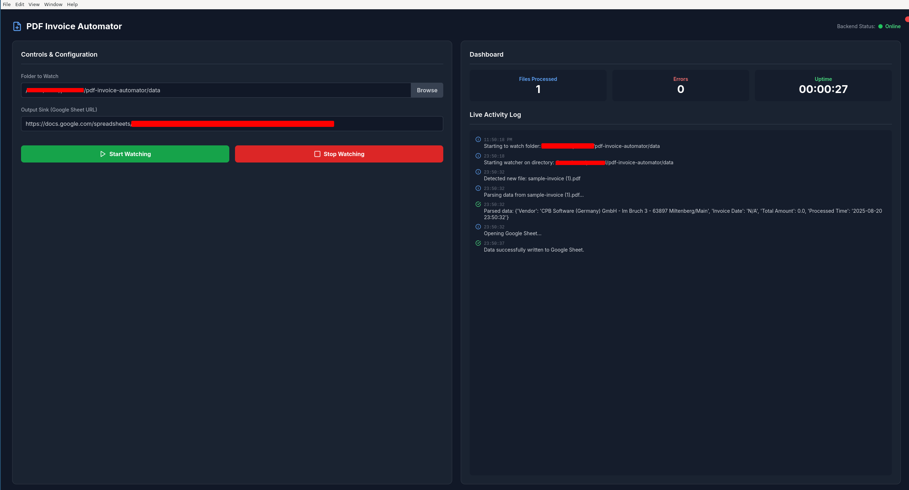

# PDF Invoice Automator

A cross-platform desktop application built with **Electron** and **Python** that automates the extraction of data from PDF invoices.  
The tool monitors a specified folder, processes new PDFs using text extraction and OCR, parses key information, and saves the data to a **Google Sheet** in real-time.

<p align="center">
  
</p>

---

## ✨ Features

- **Automated Folder Monitoring**: Watches a user-selected folder for new PDF files.  
- **Hybrid Text Extraction**: Uses **PyMuPDF** for fast text extraction and falls back to **Tesseract OCR** for scanned or image-based PDFs.  
- **Customizable Data Parsing**: Extracts key invoice data (like Vendor, Date, and Total Amount) using regular expressions.  
- **Google Sheets Integration**: Automatically appends extracted data as a new row to a specified Google Sheet.  
- **Cross-Platform**: Runs on both Linux and Windows.  
- **User-Friendly Interface**: A simple, modern dashboard to control the process and view live logs and statistics.  

---

## 🛠 Technology Stack

- **Frontend**: Electron.js  
- **Backend**: Python with FastAPI  
- **PDF Processing**: PyMuPDF, Pillow, pytesseract  
- **File Monitoring**: watchdog  
- **Sheets Integration**: gspread, pandas  
- **Packaging**: Electron Builder, PyInstaller  

---

## 🚀 Getting Started

Follow these steps to set up and run the application on your local machine.

### Prerequisites

Ensure you have the following installed:

- **Node.js and npm**: [Download here](https://nodejs.org)  
- **Python (3.11+ recommended)**: [Download here](https://www.python.org)  
- **Tesseract OCR Engine**:  
  - On **Linux (Debian/Ubuntu)**:
    ```bash
    sudo apt update && sudo apt install tesseract-ocr
    ```
  - On **Windows**: [Download from UB Mannheim repository](https://github.com/UB-Mannheim/tesseract/wiki)  
    > ⚠️ Important: During installation, make sure to add Tesseract to your system's **PATH**.

---

### Installation & Setup

#### 1. Clone the Repository
```bash
git clone https://github.com/umar052001/pdf-invoice-automator.git
cd pdf-invoice-automator
````
#### 2. Configure the Backend (Python)

This project uses **uv** for fast Python dependency management.

```bash
# Install dependencies (automatically creates and manages a virtual environment)
uv sync
```
> Note: uv will read from your pyproject.toml and lock file.
You don’t need a separate requirements.txt when using uv.
#### 3. Configure the Frontend (Electron)

```bash
npm install
```

#### 4. Set Up Google Sheets API Credentials

1. Enable APIs: In Google Cloud Console, enable **Google Drive API** and **Google Sheets API**.
2. Create a Service Account:

   * Go to **APIs & Services > Credentials**
   * Click **Create Credentials → Service Account**
   * Skip additional roles.
3. Generate JSON Key:

   * Go to **KEYS** → **ADD KEY** → **Create new key** → Select **JSON**.
   * Rename file to `credentials.json` and place it in the project root.
4. Share Google Sheet:

   * Copy `client_email` from `credentials.json`.
   * Share your target Google Sheet with this email and give **Editor** access.

#### 5. Run the Application

```bash
npm start
```

The application window will open, and the backend status should show as **Online**.

---

## 📦 Building for Production

### 1. Package the Python Backend

```bash
source .venv/bin/activate
pyinstaller --name main --onefile --noconsole main.py
```

### 2. Position the Backend Executable

```bash
mkdir backend
mv dist/main backend/   # Adjust path for your OS
```

### 3. Build the Electron App

```bash
npm run build
```

The distributable app (e.g., `PDF Invoice Automator-1.0.0.AppImage` for Linux) will be in the **dist** folder.

---

## 📜 License

This project is licensed under the **MIT License**.
See the [LICENSE](./LICENSE) file for details.


